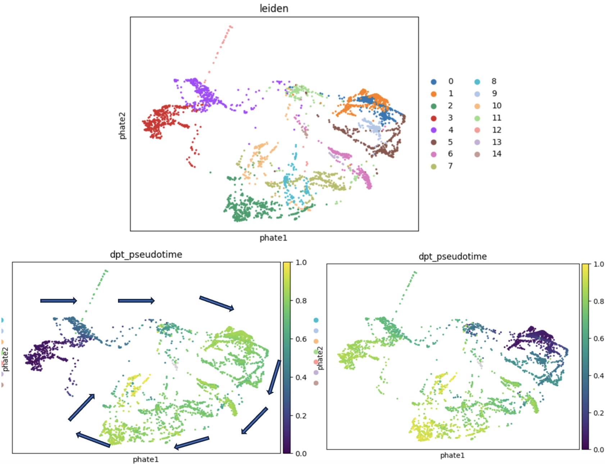

# scRNA-seq-Integration-and-Trajectory-Analysis-of-Malaria-Infected-Immune-Cells

## Overview

End-to-end single-cell analysis combining bioinformatics and unsupervised machine learning to uncover immune dynamics during malaria infection.

This project integrates scRNA-seq data from wild-type and malaria-infected mice using Scanpy, applying BBKNN and Harmony-based approaches for integration and differential expression analysis to identify cell populations, infection-driven transcriptional changes, and reconstruct dynamic cellular trajectories using graph-based and manifold learning methods, revealing complex and cyclic immune state transitions.

### Key Results Overview:

### UMAP & Annotation

**UMAP revelas 14 immune cell clusters and key populations (e.g., Ms4a1+ B cells, progenitor-like cells).**

### Pseudotime (PHATE Trajectory)

**PHATE-based trajectory analysis reveals dynamic immune cell transitions during malaria infection.**  
Top: 14 Leiden clusters projected onto PHATE embedding.  
Bottom: Pseudotime trajectories using two biologically relevant starting points:  
- Left: progenitor-like cells (cluster 3)  
- Right: Ms4a1+ B cells (cluster 1)  

Notably, PHATE reveals a **circular/looping trajectory**, suggesting cyclic immune state transitions rather than a simple linear progression.

## Dataset
- Platform: 10x Genomics 3' scRNA-seq
- Organism: Mouse (malaria infection model)
- Samples:
  - WT1 (control)
  - Infected1
  - Infected2

## Analysis Pipeline
The workflow was implemented in Python using Scanpy, following best practices for single-cell analysis:
### 1. Quality Control
- Filtering cells based on:
- Number of detected genes
- Total counts per cell
- Mitochondrial gene percentage
- Removal of low-quality cells and potential doublets
### 2. Preprocessing
- Normalization and log-transformation
- Identification of highly variable genes
- Data scaling
### 3. Dimensionality Reduction
- Principal Component Analysis (PCA)
### 4. Data Integration
- Batch correction using BBKNN (Batch Balanced KNN) and Harmony
- Integration of WT and infected samples into a shared space
### 5. Clustering
- Neighborhood graph construction
- Leiden clustering (resolution = 0.50)
- Identification of 14 distinct cell clusters
### 6. Visualization
- UMAP embedding
- PHATE embedding (for improved global structure visualization)
### 7. Cluster Annotation
- Marker gene analysis used to identify major immune populations
- Key markers:
  - Ms4a1 → B cells
  - Gata2, Tal1, Runx1, Mki67 → progenitor-like populations
### 8. Differential Expression Analysis
- Performed using multiple complementary approaches:
- BBKNN-based differential expression
- Pseudobulk methods
- Harmony-based comparisons
  - This allowed identification of robust and consistent infection-associated gene signatures.
### 9. Trajectory Inference
- Graph abstraction using PAGA
- Pseudotime analysis projected onto:
  - UMAP
  - PHATE
- Two biologically relevant starting points were explored:
  - Cluster 3 (progenitor-like cells)
  - Cluster 1 (Ms4a1+ B cells)

## Key Results

### Cell Population Structure
- 14 transcriptionally distinct clusters identified
- Infection alters immune cell composition
### Marker Gene Expression
- Successful annotation of major immune cell types
- Identification of progenitor-like populations, B cells, T cells
### Differential Expression Robustness
- Cross-method comparison (UpSet analysis) showed strong overlap
- Confirms reliability of identified infection-related genes
### Trajectory and Pseudotime Insights
- PAGA revealed connectivity between immune populations
- PHATE embedding showed:
  - Smooth transitions between cell states
  - Circular/looping trajectory, suggesting dynamic immune processes

## Biological Interpretation
- Malaria infection induces significant remodeling of the immune landscape
- Expansion of progenitor-like populations suggests active immune regeneration
- Distinct transcriptional programs emerge under infection
- Trajectory analysis indicates dynamic and potentially cyclic immune responses

## Tools & Technologies
- Python
- Scanpy
- BBKNN
- PHATE
- NumPy / Pandas / Matplotlib

## Reproducibility
The full analysis workflow, including all code and outputs, is provided in the notebook PDF.

The pipeline includes:
- Data preprocessing
- Integration
- Clustering
- Differential expression
- Trajectory inference

## Key Skills Demonstrated
- Single-cell RNA-seq analysis
- Multi-sample data integration
- Batch correction techniques
- Differential expression analysis (multiple methods)
- Trajectory and pseudotime inference
- Biological interpretation of high-dimensional data
