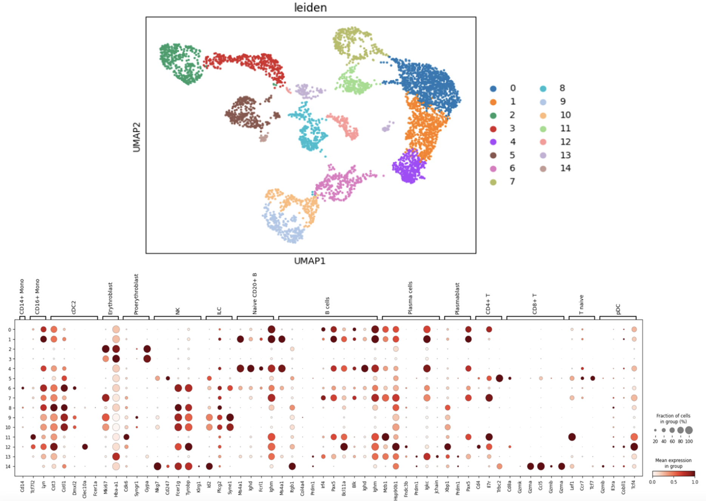

# scRNA-seq-Integration-and-Trajectory-Analysis-of-Malaria-Infected-Immune-Cells

## Overview

End-to-end single-cell analysis combining bioinformatics and unsupervised machine learning to uncover immune dynamics during malaria infection.

This project integrates scRNA-seq data from wild-type and malaria-infected mice using Scanpy and BBKNN, identifying cell populations, infection-driven transcriptional changes, and dynamic cellular trajectories.

### Key Results Overview:

#### UMAP & Annotation

### Key highlights:

- Integrated multi-sample single-cell data (WT vs infected) with batch correction
- Identified 14 immune cell clusters and annotated key populations (e.g., Ms4a1+ B cells, progenitor-like cells)
- Performed robust differential expression analysis across 4 methods
- Reconstructed cellular trajectories using PAGA and PHATE, revealing a continuous and cyclic immune response

#### Key insight: PHATE embedding reveals a looping trajectory, suggesting dynamic immune state transitions during infection.

## Dataset
- Platform: 10x Genomics 3' scRNA-seq
- Organism: Mouse (malaria infection model)
- Samples:
  - WT1 (control)
  - Infected1
  - Infected2
